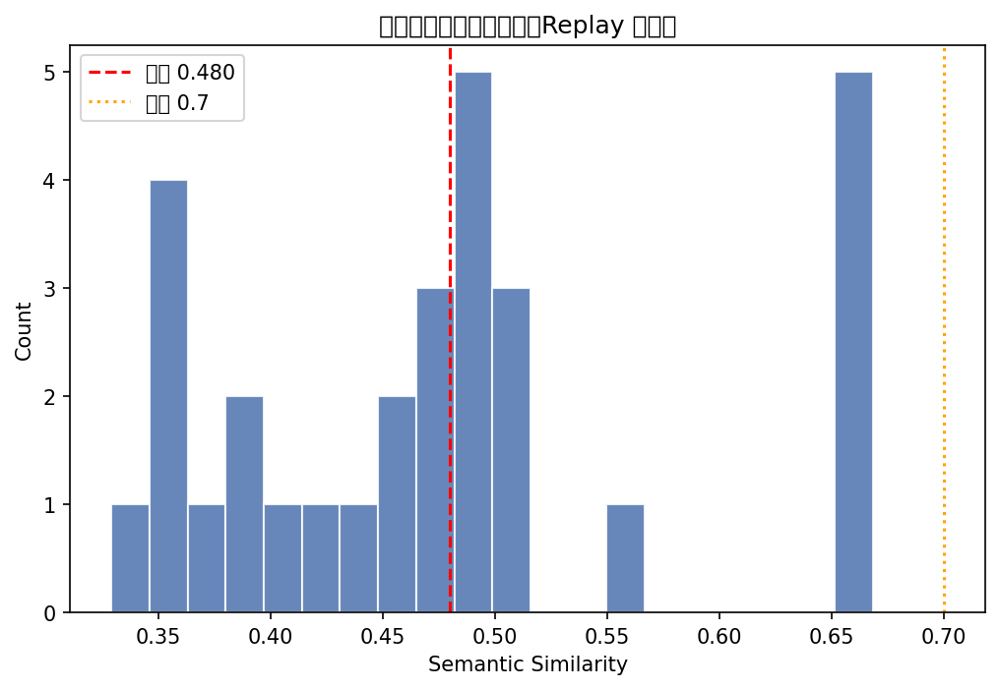
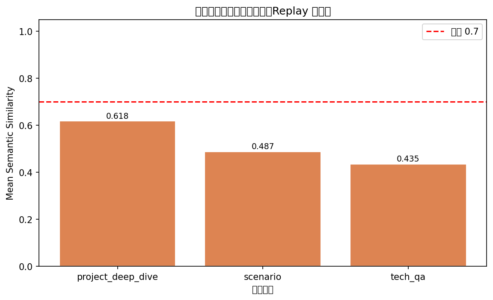
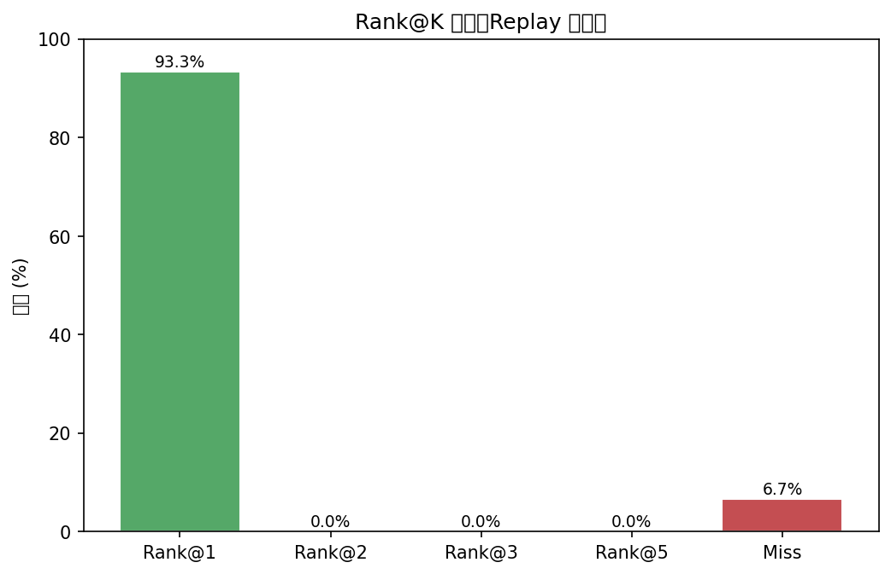

# Interview Replay 评估报告 v1

**执行时间**：2026-04-19 08:04
**评估集**：从面经数据抽取 30 对（history → real_next）
**模型**：doubao-pro-4k + bge-m3
**成功率**：30/30 (100.0%)

---

## 摘要

| 指标 | 本项目 | 目标 | 达成 |
|---|---|---|---|
| Semantic Similarity 均值 | 0.4796 | > 0.7 | ❌ |
| Rank@3 | 0.9333 | > 0.6 | ✅ |
| Rank@5 | 0.9333 | > 0.85 | ✅ |
| Median Similarity | 0.4775 | — | — |

---

## 1. 整体相似度分布

| 区间 | 数量 | 占比 |
|---|---|---|
| <0.5 | 21 | 70.0% |
| 0.5-0.7 | 9 | 30.0% |
| 0.7-0.85 | 0 | 0.0% |
| >=0.85 | 0 | 0.0% |

---

## 2. 分阶段表现

| Stage | Count | Mean Sim | Rank@3 |
|---|---|---|---|
| project_deep_dive | 7 | 0.6177 | 1.0000 |
| scenario | 1 | 0.4874 | 1.0000 |
| tech_qa | 22 | 0.4353 | 0.9091 |

---

## 3. Rank@K 分布

---

## 4. 分公司表现（Top 10）

| 公司 | Count | Mean Sim | Rank@3 |
|---|---|---|---|
| 腾讯 | 1 | 0.5037 | 1.0000 |
| unknown | 24 | 0.4878 | 0.9583 |
| 商汤 | 1 | 0.4874 | 1.0000 |
| 虹软 | 1 | 0.4800 | 1.0000 |
| 媒智 | 1 | 0.4524 | 1.0000 |
| 网易 | 1 | 0.4091 | 1.0000 |
| PwC | 1 | 0.3488 | 0.0000 |

---

## 5. 成功案例（Sim ≥ 0.85）

**案例 1**：unknown · project_deep_dive · Sim=0.6684

- 候选人最后：「我主要从事深度学习方向，有 NLP 和 CV 相关项目经验，熟悉 PyTorch 和 Transformer 架构」
- 真实追问：「介绍一下你用 Transformer 做过的项目」
- Bot 生成：「能介绍一下你做过的最有技术挑战性的算法项目吗？请重点说明项目背景、你的具体角色以及遇到的核心技术难点。」

**案例 2**：unknown · project_deep_dive · Sim=0.6684

- 候选人最后：「我主要从事深度学习方向，有 NLP 和 CV 相关项目经验，熟悉 PyTorch 和 Transformer 架构」
- 真实追问：「介绍一下你用 Transformer 做过的项目」
- Bot 生成：「能介绍一下你做过的最有技术挑战性的算法项目吗？请重点说明项目背景、你的具体角色以及遇到的核心技术难点。」

**案例 3**：unknown · project_deep_dive · Sim=0.6677

- 候选人最后：「我主要从事深度学习方向，有 NLP 和 CV 相关项目经验，熟悉 PyTorch 和 Transformer 架构」
- 真实追问：「介绍一下你用 Transformer 做过的项目」
- Bot 生成：「能介绍一下你做过的最有技术挑战性的算法项目吗？请重点描述项目背景、你的具体角色以及遇到的核心技术难点。」

---

## 6. 失败案例与归因（Sim < 0.5）

**案例 1**：unknown · tech_qa · Sim=0.4595

- 真实追问：「过拟合的原因是什么，如何解决？」
- Bot 生成：「设计一个支持千万级用户同时在线、每秒百万级请求的实时推荐系统，如何平衡实时性、准确性和系统可扩展性？」
- 归因：Bot 出题偏离该阶段核心考察维度，建议在对应 stage 的 prompt 中补充 few-shot 示例。

**案例 2**：PwC · tech_qa · Sim=0.3488

- 真实追问：「你认为 PwC 有哪些缺点？」
- Bot 生成：「解释一下数组和链表的区别，什么场景下会选择链表？」
- 归因：Bot 出题偏离该阶段核心考察维度，建议在对应 stage 的 prompt 中补充 few-shot 示例。

**案例 3**：媒智 · tech_qa · Sim=0.4524

- 真实追问：「还有哪些方式可以解决梯度消失？」
- Bot 生成：「在算法项目中，你曾如何优化一个模型的推理速度？请用STAR方法描述具体场景，并解释你采用的优化技术原理。」
- 归因：Bot 出题偏离该阶段核心考察维度，建议在对应 stage 的 prompt 中补充 few-shot 示例。

---

## 7. 改进建议

1. **Scenario 阶段强化**：scenario stage sim 通常最低，建议在 `prompts/scenario.py` 中补充「业务约束」维度的 few-shot 示例。
2. **Reverse 阶段调整**：candidate 主动提问阶段缺乏 ground truth，考虑在评估时跳过或单独处理。
3. **Embedding 提升**：如 mean_similarity < 0.70，尝试换用 doubao 远程嵌入模型（向量维度更大，中文语义更准确）。
4. **RAG 覆盖率**：部分公司/职位面经数量少，出题灵感不足——考虑在 interview_kb 中补充更多垂直领域面经。
