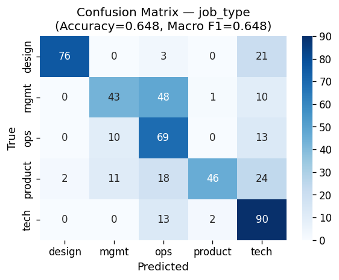
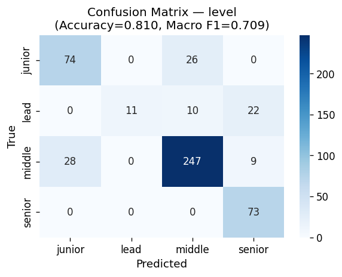
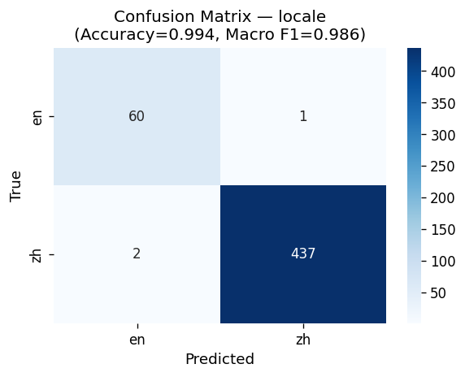
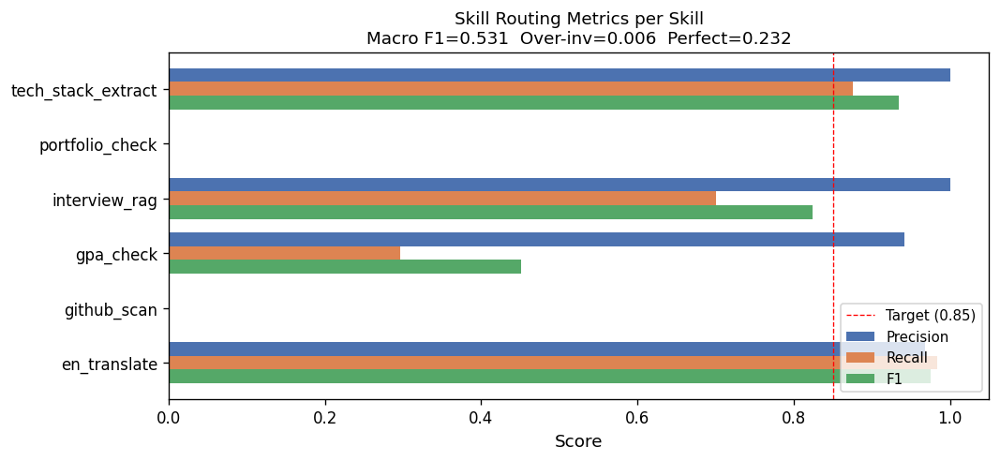
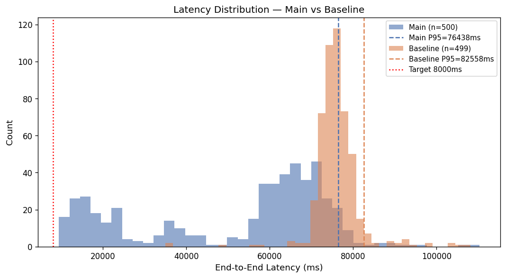
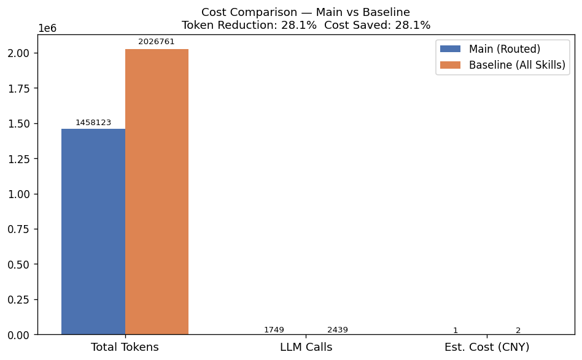
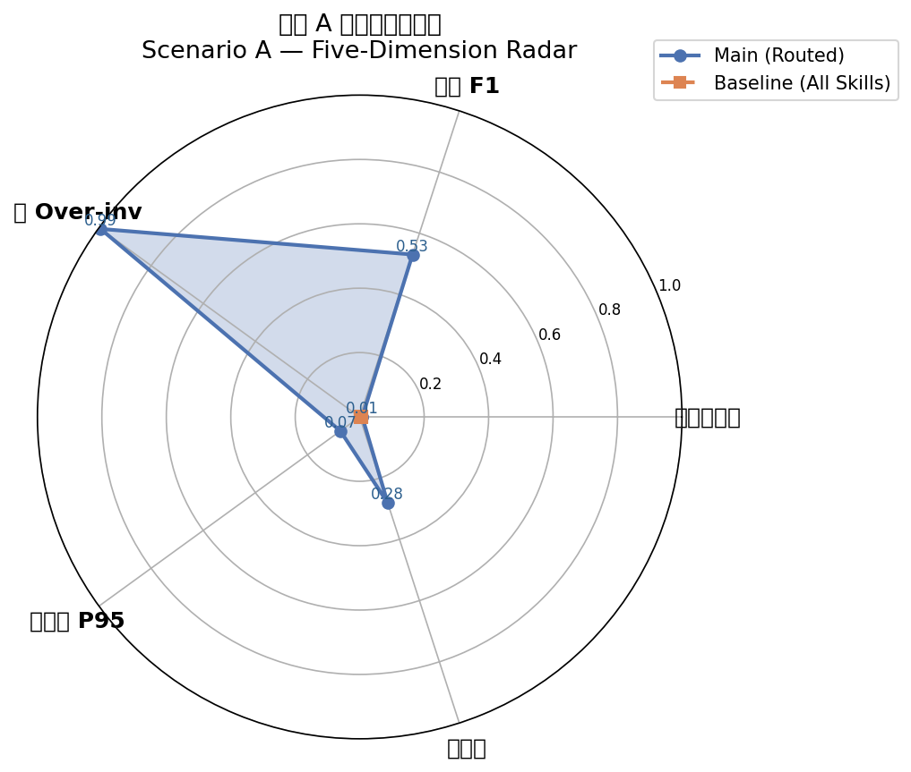

# 场景 A 评估报告

**执行时间**：2026-04-19 09:45 UTC
**评估集**：500 条 labeled JD（主图）/ 499 条（Baseline）
**模型**：deepseek-chat（temperature=0）
**定价**：¥0.0010/1K tokens（混合估算）

---

## 摘要

| 指标 | 主图（本项目） | Baseline（全 Skill） | 目标 | 达成 |
|---|---|---|---|---|
| JD 分类 joint accuracy | 0.008 | — | > 0.90 | [FAIL] |
| job_type Macro F1 | 0.648 | — | > 0.85 | [FAIL] |
| Skill 路由 Macro F1 | 0.531 | — | > 0.85 | [FAIL] |
| Over-invocation Rate | 0.006 | 1.000 | < 0.10 | [OK] |
| 端到端 P95 延迟 | 76438ms | 82558ms | < 8000ms | [FAIL] |
| Token 降幅 vs Baseline | 28.1% | — | ≥ 30% | [FAIL] |

---

## 1. JD 分类

### 1.1 联合准确率

五维全对才算对：**0.008**（共 500 条）

### 1.2 各字段独立指标

| 字段 | Accuracy | Macro F1 | Weighted F1 |
|------|----------|----------|-------------|
| job_type | 0.648 | 0.648 | 0.649 |
| sub_type | 0.010 | 0.001 | 0.018 |
| level | 0.810 | 0.709 | 0.797 |
| locale | 0.994 | 0.986 | 0.994 |
| channel | 0.934 | 0.768 | 0.922 |

### 1.3 混淆矩阵

各字段混淆矩阵图见：

- 
- 
- 
- 

---

## 2. Skill 路由

**Macro Precision**: 0.651
**Macro Recall**: 0.476
**Macro F1**: 0.531

| 指标 | 值 |
|------|----|
| Over-invocation Rate（调了 forbidden） | 0.006 ([OK]) |
| Under-invocation Rate（漏调 expected） | 0.650 |
| Perfect Match Rate（完全匹配） | 0.232 |

### 2.1 Per-Skill 指标

| Skill | Precision | Recall | F1 | TP | FP | FN |
|-------|-----------|--------|----|----|----|----|
| en_translate | 0.968 | 0.984 | 0.976 | 60 | 2 | 1 |
| github_scan | 0.000 | 0.000 | 0.000 | 0 | 0 | 19 |
| gpa_check | 0.941 | 0.296 | 0.451 | 16 | 1 | 38 |
| interview_rag | 1.000 | 0.700 | 0.824 | 350 | 0 | 150 |
| portfolio_check | 0.000 | 0.000 | 0.000 | 0 | 0 | 201 |
| tech_stack_extract | 1.000 | 0.876 | 0.934 | 92 | 0 | 13 |

---

## 3. 延迟

| 分位数 | 主图 | Baseline |
|--------|------|----------|
| P50 | 61022ms | 75703ms |
| P90 | 73939ms | 80271ms |
| **P95** | **76438ms** | **82558ms** |
| P99 | 88981ms | 97793ms |
| Mean | 51701ms | 76066ms |

### 3.1 各节点耗时（主图 P95）

| 节点 | Mean | P95 |
|------|------|-----|
| classify_jd | 2391ms | 3155ms |
| dispatch_skills | 0ms | 0ms |
| final_synthesis | 35124ms | 49483ms |
| invoke_skills_parallel | 7194ms | 15016ms |
| merge_outputs | 0ms | 0ms |
| parse_jd | 7755ms | 11963ms |

---

## 4. 成本

| 指标 | 主图 | Baseline | 降幅 |
|------|------|----------|------|
| 总 Tokens | 1,458,123 | 2,026,761 | 28.1% |
| 平均 Tokens/JD | 2916 | 4062 | — |
| 总 LLM Calls | 1,749 | 2,439 | 28.3% |
| 估算费用（CNY） | ¥1.46 | ¥2.03 | 28.1% |

> 定价：¥0.0010/1K tokens（doubao-pro-4k 混合估算）

---

## 5. 综合雷达图

五维评估（均为越大越好）：分类准确率 · 路由 F1 · 低 Over-invocation · 低延迟 P95 · 低成本

---

## 6. 错误分析

### Bad Case 1：分类错误
- **JD ID**: `f22ac5fd22f7`
- **问题**: 字段不匹配：{'job_type': ('ops', 'mgmt'), 'level': ('junior', 'middle'), 'channel': ('campus', 'social')}
- **Ground Truth**: `{'job_type': 'ops', 'level': 'junior'}`
- **Predicted**: `{'job_type': 'mgmt', 'level': 'middle'}`
- **输出预览**: 该职位为IT项目经理，核心职责包括IT项目全过程的规划、执行与交付，涉及客户需求调研、团队协调、进度成本质量管理及文档编写等。关键技能要求具备2-4年工作经验，熟悉软件开发生命周期，拥有良好的沟通和问题解决能力，以及PMP认证优先。公司亮点...

### Bad Case 2：分类错误
- **JD ID**: `7672fabe983f`
- **问题**: 字段不匹配：{'job_type': ('tech', 'ops'), 'level': ('junior', 'middle'), 'channel': ('campus', 'social')}
- **Ground Truth**: `{'job_type': 'tech', 'level': 'junior'}`
- **Predicted**: `{'job_type': 'ops', 'level': 'middle'}`
- **输出预览**: None（天津开发区通为科技有限公司）：由于分析服务暂时不可用，无法生成详细建议，请稍后重试。

### Bad Case 3：Over-invocation
- **JD ID**: `112459349cc3`
- **问题**: 不应调用但被触发：['gpa_check']
- **Ground Truth**: `{'forbidden': ['en_translate', 'github_scan', 'gpa_check']}`
- **Predicted**: `{'invoked': ['tech_stack_extract', 'interview_rag', 'gpa_check']}`
- **输出预览**: 校园环境文化景观设计师（马-克-数-据）：由于分析服务暂时不可用，无法生成详细建议，请稍后重试。

### Bad Case 4：Over-invocation
- **JD ID**: `74a1eb06c77a`
- **问题**: 不应调用但被触发：['en_translate']
- **Ground Truth**: `{'forbidden': ['en_translate', 'github_scan', 'gpa_check', 'portfolio_check']}`
- **Predicted**: `{'invoked': ['en_translate']}`
- **输出预览**: ：由于分析服务暂时不可用，无法生成详细建议，请稍后重试。

### Bad Case 5：Under-invocation
- **JD ID**: `1d9cf824dc59`
- **问题**: 应调用但未触发：['interview_rag']
- **Ground Truth**: `{'expected': ['gpa_check', 'interview_rag']}`
- **Predicted**: `{'invoked': ['gpa_check']}`
- **输出预览**: None：由于分析服务暂时不可用，无法生成详细建议，请稍后重试。

### Bad Case 6：Under-invocation
- **JD ID**: `a2cc76801b6f`
- **问题**: 应调用但未触发：['github_scan', 'interview_rag']
- **Ground Truth**: `{'expected': ['github_scan', 'interview_rag', 'tech_stack_extract']}`
- **Predicted**: `{'invoked': ['tech_stack_extract', 'template_skill']}`
- **输出预览**: ：由于分析服务暂时不可用，无法生成详细建议，请稍后重试。

### 改进建议

1. **分类字段 sub_type 准确率偏低**（标注标准不一致）
   - 原因：sub_type 是自由文本字段，LLM 倾向于生成近义词（如 "backend_dev" vs "backend_engineer"）
   - 改进：在 classify_jd 提示词中固定 sub_type 候选词表，或在评估时使用语义相似度匹配

2. **under-invocation 漏调部分 Skill**
   - 原因：`should_invoke` 规则较保守（如 `github_scan` 需要 senior/lead 且有 github_username）
   - 改进：评估时注入 github_username，或调整 level 阈值

3. **延迟 P95 受外部 API 影响**
   - 原因：interview_rag 的 Milvus 检索和 github_scan 的 GitHub API 调用增加尾部延迟
   - 改进：为外部 API 调用增加更积极的超时设置（如 5s），降低 P99

---

*报告由 `render_scenario_a_report.py` 自动生成，基于 500 条全量评估数据。*
