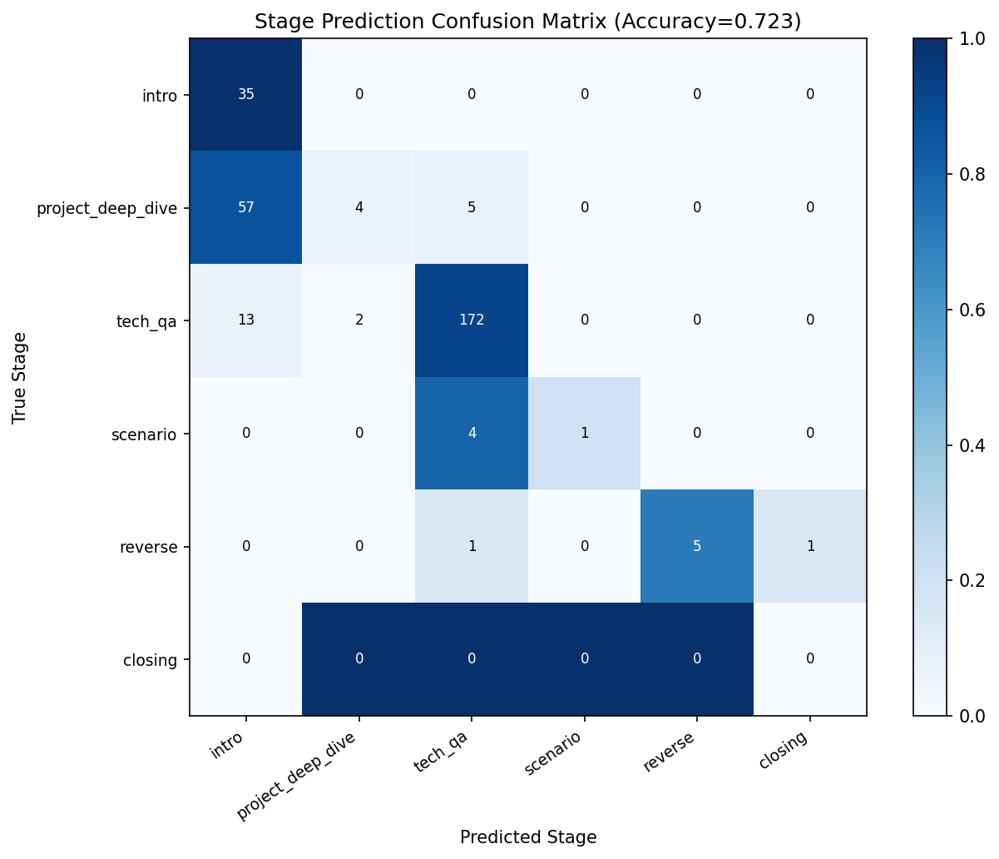

# 阶段推进准确率评估报告 v1

**执行时间**：2026-04-19 08:09
**模型**：deepseek-chat
**总样本数**：300

---

## 摘要

| 指标 | 本项目 | 目标 | 达成 |
|---|---|---|---|
| Accuracy | 0.7233 | > 0.85 | ❌ |

---

## 1. 混淆矩阵

| True \ Pred | intro | project_deep_dive | tech_qa | scenario | reverse | closing |
|---|---|---|---|---|---|---|
| **intro** | 35 | 0 | 0 | 0 | 0 | 0 |
| **project_deep_dive** | 57 | 4 | 5 | 0 | 0 | 0 |
| **tech_qa** | 13 | 2 | 172 | 0 | 0 | 0 |
| **scenario** | 0 | 0 | 4 | 1 | 0 | 0 |
| **reverse** | 0 | 0 | 1 | 0 | 5 | 1 |
| **closing** | 0 | 0 | 0 | 0 | 0 | 0 |

---

## 2. 分阶段指标

| Stage | Precision | Recall | F1 |
|---|---|---|---|
| intro | 0.3333 | 1.0000 | 0.5000 |
| project_deep_dive | 0.6667 | 0.0606 | 0.1111 |
| tech_qa | 0.9451 | 0.9198 | 0.9322 |
| scenario | 1.0000 | 0.2000 | 0.3333 |
| reverse | 1.0000 | 0.7143 | 0.8333 |
| closing | 0.0000 | 0.0000 | 0.0000 |

---

## 3. Top 5 易混淆阶段对

| True → Pred | 混淆率 |
|---|---|
| project_deep_dive → intro | 86.4% |
| scenario → tech_qa | 80.0% |
| reverse → tech_qa | 14.3% |
| reverse → closing | 14.3% |
| project_deep_dive → tech_qa | 7.6% |

---

## 4. 失败归因分析

**intro**（F1=0.5000）：
- 该阶段的对话特征与相邻阶段高度相似，建议在 prompt 中补充更清晰的阶段边界描述。

**project_deep_dive**（F1=0.1111）：
- 该阶段的对话特征与相邻阶段高度相似，建议在 prompt 中补充更清晰的阶段边界描述。

**scenario**（F1=0.3333）：
- 该阶段的对话特征与相邻阶段高度相似，建议在 prompt 中补充更清晰的阶段边界描述。

**closing**（F1=0.0000）：
- 该阶段的对话特征与相邻阶段高度相似，建议在 prompt 中补充更清晰的阶段边界描述。

---

## 5. 改进建议

1. **强化边界阶段描述**：`project_deep_dive` 与 `tech_qa` 内容相似，可在 predict_stage prompt 中增加区分示例。
2. **扩充训练样本**：`reverse` / `closing` 阶段样本量少，F1 方差大，可从更多面经中补充这两个阶段的样本。
3. **Few-shot 示例**：在 predict_stage system prompt 中加入 1-2 个 few-shot 对话示例，提升 `scenario` vs `tech_qa` 的判别准确率。
