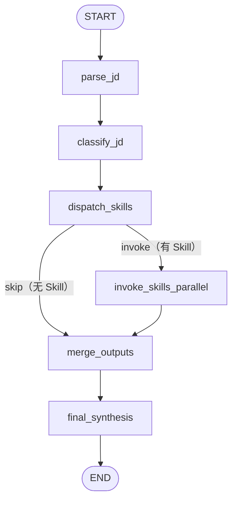

# JD 路由 LangGraph 主图

> 本模块实现 JobPilot 的核心编排逻辑：接收一段 JD 文本，经过 6 个节点的串/并行处理，输出结构化求职建议报告。

---

## 图拓扑



> 生成最新 Mermaid 图：`uv run python scripts/export_graph_visualization.py`

---

## 目录结构

```
graphs/
├── __init__.py
├── state.py                # JDRoutingState TypedDict + ParsedJD
├── jd_routing_graph.py     # StateGraph 组装 + 单例工厂
├── visualize.py            # 导出 Mermaid 图
├── nodes/
│   ├── parse_jd.py         # JD 文本 → 结构化字段（LLM）
│   ├── classify_jd.py      # 结构化字段 → 5 维分类（LLM）
│   ├── dispatch_skills.py  # 分类 → Skill 路由决策（规则）
│   ├── invoke_skills_parallel.py  # 并行执行 Skill（asyncio.gather）
│   ├── merge_outputs.py    # 聚合 Skill 输出（纯计算）
│   └── final_synthesis.py  # 生成最终报告（LLM）
└── prompts/
    ├── parse_jd.py         # parse_jd 节点提示词
    ├── classify_jd.py      # classify_jd 节点提示词（含 few-shot）
    └── final_synthesis.py  # final_synthesis 节点提示词
```

---

## State 说明（`state.py`）

| 字段 | 类型 | 填充节点 | Reducer |
|------|------|---------|---------|
| `request_id` | `str` | 初始化 | — |
| `user_id` | `str` | 初始化 | — |
| `jd_text` | `str` | 初始化 | — |
| `user_context` | `dict` | 初始化 | — |
| `parsed_jd` | `dict` | `parse_jd` | — |
| `classification` | `dict` | `classify_jd` | — |
| `invoked_skills` | `list[str]` | `dispatch_skills` | — |
| `skipped_skills` | `list[str]` | `dispatch_skills` | — |
| `skill_outputs` | `list[dict]` | `invoke_skills_parallel` | **add（累积）** |
| `merged_skill_data` | `dict` | `merge_outputs` | — |
| `final_result` | `dict` | `final_synthesis` | — |
| `metadata` | `dict` | 所有节点 | **dict_merge（后写不覆盖前写）** |
| `errors` | `list[dict]` | 所有节点（失败时） | **add（累积）** |

### 并行写安全设计

`skill_outputs` 和 `errors` 使用 `Annotated[list, operator.add]`，`metadata` 使用自定义 `_dict_merge`。即使未来多个节点并发写入同一字段，LangGraph 也会安全合并，不会产生竞态条件。

---

## 节点职责

### `parse_jd`
- **输入**：`jd_text`（原始 JD 文本）
- **输出**：`parsed_jd`（company, position, responsibilities, requirements 等）
- **LLM**：是
- **降级**：LLM 失败 → 返回空 `parsed_jd`，记录 `errors`，不阻断图

### `classify_jd`
- **输入**：`parsed_jd`
- **输出**：`classification`（job_type / sub_type / level / locale / channel）
- **LLM**：是（含 few-shot 示例）
- **降级**：LLM 失败 → 返回默认分类（tech/middle/zh/social），记录 `errors`

### `dispatch_skills`
- **输入**：`classification`, `parsed_jd`, `user_context`
- **输出**：`invoked_skills`, `skipped_skills`
- **LLM**：否（规则路由，调用 `SkillDispatcher.dispatch`）
- **核心**：调用 `register_all_skills()` → 构建 `JDContext` → `SkillDispatcher().dispatch(ctx)`

### `invoke_skills_parallel`
- **输入**：`invoked_skills` 名称列表 + JDContext 所需所有字段
- **输出**：`skill_outputs`（`SkillOutput` 序列化 dict 列表）
- **并行**：`asyncio.gather(..., return_exceptions=True)`
- **降级**：单个 Skill 抛原生异常 → 生成失败 `SkillOutput`，记录 `errors`，不影响其他 Skill

### `merge_outputs`
- **输入**：`skill_outputs`
- **输出**：`merged_skill_data`（只含成功的 Skill data），`metadata.merge_outputs`（token/延迟统计）
- **LLM**：否（纯聚合计算）

### `final_synthesis`
- **输入**：`parsed_jd`, `classification`, `merged_skill_data`
- **输出**：`final_result`（jd_summary, resume_advice, interview_questions）
- **LLM**：是
- **降级**：LLM 失败 → 返回含提示信息的最小结果，记录 `errors`

---

## 条件边：`_should_invoke_any_skill`

```python
def _should_invoke_any_skill(state):
    return "invoke" if state.get("invoked_skills") else "skip"
```

- `"invoke"` → `invoke_skills_parallel`
- `"skip"` → `merge_outputs`（直接跳过 Skill 执行）

---

## API 入口

`POST /api/v1/agent/jd-routing` （`api/jd_routing.py`）

请求体：
```json
{
  "request_id": "req-001",
  "user_id": "user-001",
  "jd_text": "职位 JD 文本（50-10000字）...",
  "user_context": {
    "preferred_lang": "zh",
    "github_username": "octocat",
    "portfolio_doc_ref": "FeishuDocToken"
  }
}
```

---

## 单例工厂

```python
from jobpilot_agent.graphs import get_jd_routing_graph

graph = get_jd_routing_graph()
state = await graph.ainvoke(initial_state)
```

`get_jd_routing_graph()` 懒加载单例，首次调用编译图（< 50ms），后续直接返回缓存实例。

---

## 调试工具

### 流式执行（逐节点观察输出）

```bash
cd python-agent
uv run python scripts/demo_jd_routing.py
uv run python scripts/demo_jd_routing.py --jd "后端工程师，要求 Python 5年..."
```

### 导出 Mermaid 图

```bash
uv run python scripts/export_graph_visualization.py
# 输出：docs/jd_routing_graph.mmd
```

### 查看图结构（Python）

```python
from jobpilot_agent.graphs import get_jd_routing_graph
graph = get_jd_routing_graph()
print(graph.get_graph().draw_mermaid())
```

---

## 扩展指南

### 添加新节点

1. 在 `nodes/` 目录创建 `new_node.py`，实现 `async def new_node(state) -> dict`
2. 在 `jd_routing_graph.py` 中：
   - `builder.add_node("new_node", new_node)`
   - 在合适位置添加 `builder.add_edge(...)` 或 `builder.add_conditional_edges(...)`
3. 若节点需要独立提示词，在 `prompts/` 目录创建对应 `new_node.py`

### 添加新 Skill

参见 `skills/README.md`。新 Skill 注册后，`dispatch_skills` 节点会自动感知，无需修改图结构。

### 修改路由逻辑

路由规则集中在各 Skill 的 `should_invoke()` 方法（`skills/*/index.py`），以及 `classify_jd` 节点的提示词（`prompts/classify_jd.py`）。修改这两处即可影响路由决策，无需改动图拓扑。

---

## 测试

```bash
cd python-agent
uv run pytest tests/graphs/ -v
```

6 个端到端测试（全部 mock LLM 和 Skill，无真实网络调用）：

| 测试 | 场景 | 关键断言 |
|------|------|---------|
| `test_tech_senior_zh_full_flow` | tech/senior JD | invoked_skills 包含 tech_stack_extract |
| `test_product_campus_flow` | product/campus JD | gpa_check 被触发 |
| `test_en_locale_triggers_en_translate` | locale=en JD | en_translate 被调用 |
| `test_skill_failure_does_not_break_graph` | 单 Skill 失败 | 图完成，errors[] 有记录 |
| `test_no_skills_invoked_still_completes` | 无 Skill 被选中 | 走 skip 路径，final_result 存在 |
| `test_parallel_skills_execute_concurrently` | 3 个慢 Skill | 总耗时 < 2s（并行） |
