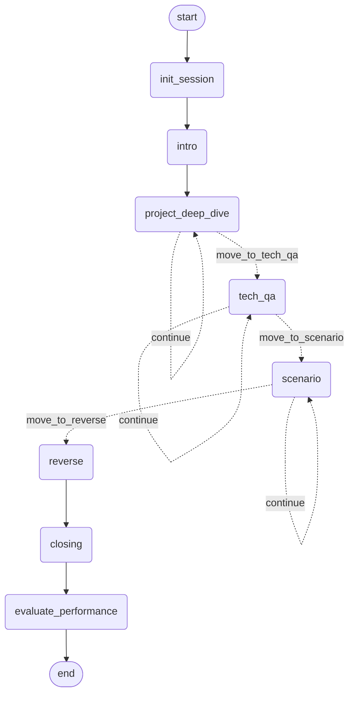

# 面试子图

完整的 LangGraph 面试 Bot，支持多阶段对话、断点续传、整体复盘报告。

---

## 完整状态转移图（Mermaid）



---

## API 使用示例

### 开始面试（curl）

```bash
curl -X POST http://localhost:8001/api/v1/agent/interview/start \
  -H "Content-Type: application/json" \
  -d '{
    "thread_id": "sess-001",
    "user_id": "user-42",
    "company": "字节跳动",
    "position": "高级后端工程师",
    "context": {}
  }'
# 返回：{"thread_id":"sess-001","state":"waiting_user_input","next_action":{"type":"ask_question","content":"...","stage":"intro"}}
```

### 提交回答（curl）

```bash
curl -X POST http://localhost:8001/api/v1/agent/interview/resume \
  -H "Content-Type: application/json" \
  -d '{"thread_id":"sess-001","user_input":"我是一名有 5 年经验的后端工程师..."}'
```

### 查询状态

```bash
curl http://localhost:8001/api/v1/agent/interview/sess-001/status
```

### Python 客户端

```python
import httpx, asyncio

async def run():
    async with httpx.AsyncClient(base_url="http://localhost:8001") as c:
        r = await c.post("/api/v1/agent/interview/start", json={
            "thread_id": "test-1", "user_id": "u1",
            "company": "字节跳动", "position": "高级后端", "context": {}
        })
        data = r.json()
        while data["state"] == "waiting_user_input":
            print("面试官：", data["next_action"]["content"])
            user = input("你：")
            r = await c.post("/api/v1/agent/interview/resume",
                             json={"thread_id": "test-1", "user_input": user})
            data = r.json()
        print("报告：", data["report"])

asyncio.run(run())
```

---

## 断点续聊调试指南

```python
from jobpilot_agent.graphs.interview.interview_subgraph import get_interview_subgraph

graph = get_interview_subgraph()
config = {"configurable": {"thread_id": "sess-001"}}

# 查看任意 thread 当前状态
snapshot = await graph.aget_state(config)
print("当前节点：", snapshot.next)
print("挂起的 interrupt：", snapshot.interrupts)
print("当前 stage：", snapshot.values.get("current_stage"))
print("已完成轮次：", snapshot.values.get("stage_round_count"))

# 回放历史（时间旅行）
async for s in graph.aget_state_history(config):
    print(s.created_at, s.next)
```

---

## 已知限制

- **LLM 超时**：`run_interview_turn` 中 LLM 调用超时会触发异常降级（返回 `errors` 字段），不中断图。但 `ask_user_interrupt` 后的 interrupt 会一直等待用户输入，无自动超时。
- **节点重放**：LangGraph interrupt() 在 `Command(resume=...)` 时会从节点头重新执行，导致 `generate_next_question` 被调用两次（一次 start，一次 resume）。实际面试中问题可能略有不同（temperature=0.7），属于设计取舍。
- **并发限制**：同一 `thread_id` 不支持并发 resume，请在上一个 resume 完成后再发下一个请求。

---

## State 字段与 Reducer 语义

| 字段 | Reducer | 原因 |
|------|---------|------|
| `transcript` | `_append_turns` | 按 turn_id 去重追加，避免并发写重复 |
| `stage_round_count` | `_inc_round` | 同键累加（非覆盖），正确统计各阶段轮数 |
| `stage_history` | `add`（list extend） | 顺序追加完成的阶段列表 |
| `performance_signals` | `add` | 每轮打分追加 |
| `errors` | `add` | 错误信息追加 |
| `metadata` | `_dict_merge` | 跨节点合并键值对 |
| `current_stage` | **无 reducer** | 单节点写；有 reducer 会掩盖并发 bug |

---

## Checkpointer 切换

| 环境 | Backend | 配置项 |
|------|---------|--------|
| 本地开发 | SQLite | `CHECKPOINTER_BACKEND=sqlite`（默认） |
| 生产/演示 | Postgres | `CHECKPOINTER_BACKEND=postgres` + `POSTGRES_URL=...` |

FastAPI lifespan 在启动时调用 `init_checkpointer()`，关闭时调用 `close_checkpointer()`。
图编译时通过 `get_active_checkpointer()` 获取单例。

---

## InterviewerCore 设计哲学

`InterviewerCore` 是「面试官如何出题」的单一实现：

- **纯方法**：无副作用，无内部状态，State 由子图管理
- **双调用路径**：
  - `generate_next_question()`：子图节点在每个阶段调用，出一问
  - `generate_top_k_questions(k=5)`：Replay 评估调用，出 K 个候选问题，用于计算 Rank@K
- **RAG 增强**：每次出题前检索真实面经，保证问题贴近实际面试

这样设计保证子图执行的「面试官行为」与 Replay 评估的「面试官行为」完全一致，不会因实现分叉导致评估失真。

---

## Interrupt 使用范式

```python
from jobpilot_agent.graphs.interview import ask_user_interrupt, Command

# 节点内部（P4.1b 实现）
async def intro_node(state: InterviewState) -> dict:
    question = await get_interviewer_core().generate_next_question(...)
    # 暂停，等用户输入
    user_answer = ask_user_interrupt(question)
    # 用户调用 graph.ainvoke(Command(resume="用户回答"), config) 后，这里继续
    ...

# FastAPI 路由（P4.1c 实现）
# 首次调用（启动面试）
result = await graph.ainvoke(initial_state, config={"configurable": {"thread_id": thread_id}})

# 用户有输入后（恢复）
result = await graph.ainvoke(
    Command(resume=user_input),
    config={"configurable": {"thread_id": thread_id}},
)
```
